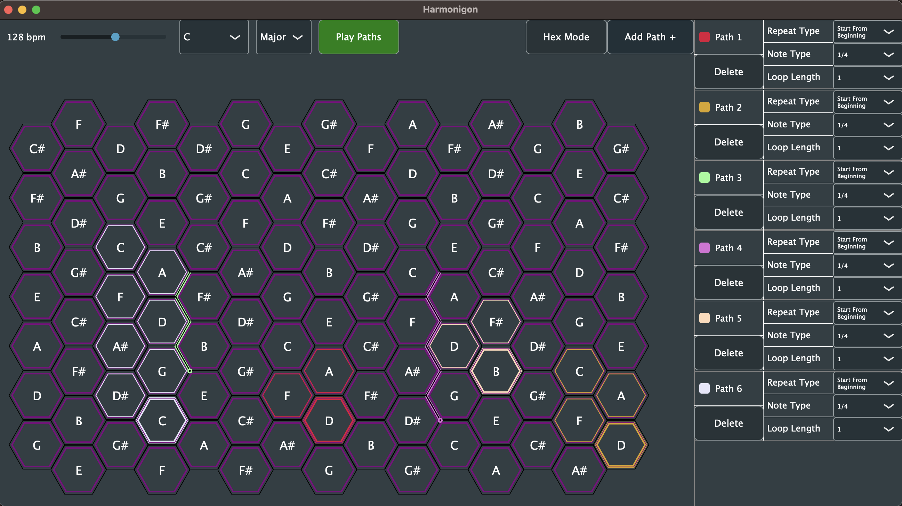

# The Harmonigon     

A simple harmonic table MIDI sequencer.

Create repeating paths with the notes and intersections (chords) on the harmonic table!

Is anything important missing or needed? Open an [Issue](github.com/StrangeLoopsAudio/Harmonigon/issues) and let us know!

If you'd like to donate to support the developers with the occasional coffee, you can set that up here: 

<noscript></noscript>